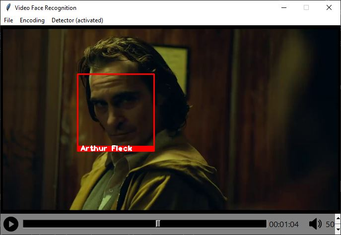

==============================
Video Face Recognition Project
==============================
|  This library provides a simple tkinter GUI to view video files and recognize
   faces in real-time. These faces can be labelled using beforehand created face encodings.
|  As such, the library provides the necessary functionality to create these face
   encodings and open/display videos based on menu buttons.
|  To achieve this, this library builds a wrapper to the `python-vlc <https://github.com/oaubert/python-vlc>`_
   library to load and display the video
   files using the VLC software. To recognize/detect faces and to create face encodings
   `face_recognition <https://github.com/ageitgey/face_recognition>`_ is used.
   `face_recognition <https://github.com/ageitgey/face_recognition>`_ employs
   `dlib's <http://dlib.net/>`_ deep learning face recognition model.

Trivia
    During development and testing, movie trailers and face encodings of their actors were used.
    This is the sole reason why the following examples focus on the Joker
    trailer. It can be used for any video and all human faces.

Installation
============
Important
    This Software uses the python bindings to access the locally installed VLC media
    player. Therefore, **VLC has to be installed on the machine**.

|  As a packaging and dependency management tool I used `Poetry <https://python-poetry.org/>`_.
   Therefore, Poetry has to be installed. For a detailed guide view the documentation
   `here <https://python-poetry.org/docs/#installation>`_.
|  Once Poetry is installed and the git repository was downloaded. Ideally all one has
   to do is to run in the project directory:

    poetry install

|  to install the dependencies listed in the poetry.lock file. If it was successful, congratulations
   you are already finished with the installation.
|  What if it fails:

    Most likely the python version you used was not compatible.
    For reference, during development I used the version 3.8.10.

How to open the video player ?
==============================
To open the GUI including the video player and tkinter frame one has to:

#. Navigate into the video_face_recognition directory
#. Open a python interpreter
#. Import the video_player module
#. |  Open the window using the so called open_window() method
   |  (Alternatively open_window accepts one parameter, the path to an initial video file which should be opened.)

Note:
 Video files can also be switched using the GUI later one.

**Example using Windows 10**::

    cd path_to_directory\video_face_recognition
    py
    import video_player as vp
    # without initial video file
    vp.open_window()

    # or with an initial video file
    vp.open_window(initial_source="JOKER.mp4")

Other possible input parameters:

* num_jitters: How many times to re-sample the face when calculating encoding (default is 20)
* frames_to_skip: The number of frames to skip, meaning if frames_to_skip=3 only every fourth frame is shown (default is 3)
* face_recognition_model: Model used for face recognition either cnn (expensive and accurate) or hog (fast and default)

Preparing the Face Recognition
===============================
The first step after opening the Window is, to make sure that for each person to detect a valid face encoding exists.
The number of known faces is shown in the Detector->Activated label. 

To add face encodings click on Encoding->Add face encoding. This will open a dialog to select an image file,
the selected image is then searched for faces and used to create the face encoding.
The file has to satisfy two properties:

#. There is only one face in the file.
#. The file name has to be the name of the person as it is used in this way.
   Alternatively renaming the .encoding file does the trick for you.

If a valid encoding was generated it is stored in the encodings directory. During start of the application all
encodings are read from there.

Starting the Face Recognition
=============================
If we did not start the application directly with a video file (see How to open the video player ?), 
open it by clicking on File->Open. From there you can navigate through your directories and open your video file.

The last step to be done, is to activate the face recognition using Detector->Activate. This option is disabled as long
as there does not exist any face encoding.

Now it should work, feel free to try :)

